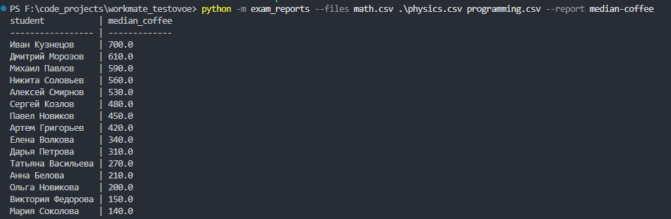
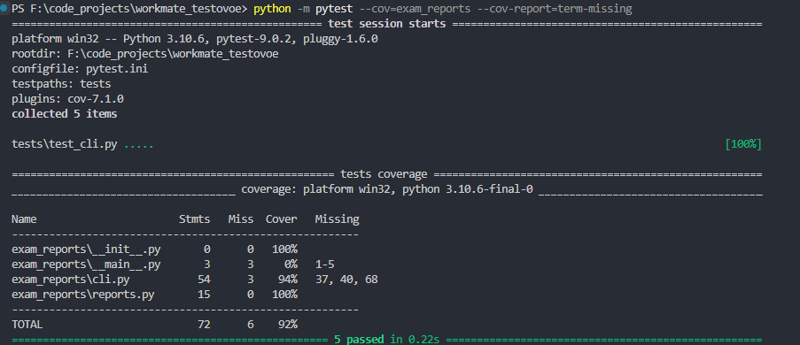

# Exam Reports

Решение с разделением на CLI и отдельную логику отчётов. Текущий отчёт median-coffee считает медиану по полю coffee_spent для каждого студента сразу по всем переданным файлам и сортирует результат по убыванию.

Расширение под новые отчёты заложено через REPORT_BUILDERS. Чтобы добавить новый вариант, нужно написать отдельную функцию и зарегистрировать её по имени. Тесты покрыли основной сценарий, объединение нескольких файлов и ошибку запуска с неизвестным отчётом и отсутствующим файлом.

Скриншоты выполнения представлены ниже.

#Отчёт

#Тесты

